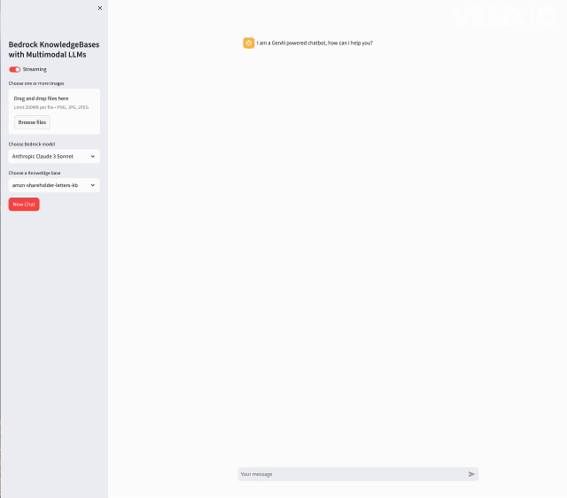

# Multimodal Chatbot with Bedrock Knowledge Base Integration

This project is a Streamlit application that combines the capabilities of Bedrock knowledge bases with multimodal language models (LLMs). The application allows users to ask questions and receive relevant responses based on the selected knowledge base and multimodal LLM. Users can also upload images to supplement their queries.




## Installation

1. Clone the repository:
```
git clone https://github.com/aws-samples/rag-multimodal.git
cd rag-multimodal/
```

2. Create and activate a virtual environment
```
python3 -m venv venv
source venv/bin/activate
```

3. Install the required Python packages:
```
pip install -r requirements.txt
```

3. Overwrite the `config.json` file with the your preferred parameters

4. If you want to create a new knoweldge base, take a look at the CLI tool `create_kb.py` in the `scripts/` folder
```
python scripts/create_kb.py --help 
```
In that case, you would need to have an AWS Role with the follwoing polices [here](doc/kb-polices.txt)

If you want to upload documents from local to the KnowledgeBase, add the documents to `scripts/data` folder. Otherwise, you can also specify a custom S3 bucket name to the `create_kb.py` script.

5. [Optional] You can delete the created knowledgeBase from setp 4 with the following script:
```
python scripts/delete_kb.py
```

## Usage
1. Ensure your terminal session can access the AWS account via SSO, environment variables or any mechanism you use

2. Start the Streamlit application:

```
streamlit run app/main.py

```

